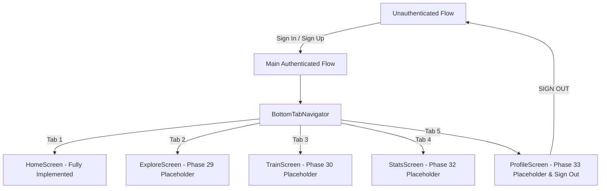

# Kinetra Mobile Engineering Progress

## Phase 27 — Mobile Foundation & Auth UI

**Status**: Complete  
**Platform**: React Native / Expo (TypeScript)  
**Visual Aesthetic**: Dark Luxury / Athletic AI Precision (Onyx `#050607`, Gold `#D9B83F` / `#F0C83E`, Crimson `#E63946`)

---

### 1. Architecture Overview (Phase 27)

The mobile client is structured as a modular Expo application located in `/mobile`, isolated from the backend API server.

---

## Phase 28 — Home Dashboard & Mobile Navigation

**Status**: Complete  
**Platform**: React Native / Expo (TypeScript)  
**Visual Aesthetic**: Stitch UI Luxury Dark Athletic (Onyx `#050607`, Gold `#D9B83F`, Titanium `#F4F1EA`, Crimson `#E63946`)

---

### 1. Architecture & Directory Structure

```
mobile/
├── App.tsx                       # Root application entry with SafeAreaProvider & AuthProvider
├── app.json                      # Expo application manifest
├── package.json                  # Dependencies & scripts (Expo, React Navigation, Supabase)
├── tsconfig.json                 # TypeScript compiler configuration
├── assets/
│   └── images/                   # Stitch visual reference assets & workout artwork
└── src/
    ├── api/
    │   └── client.ts             # Typed secure API client attaching Bearer JWT, safe envelope parser
    ├── config/
    │   └── supabase.ts           # Supabase Client SDK (Anon/Public Client Key only)
    ├── context/
    │   └── AuthContext.tsx        # React context for user sessions, auth actions & errors
    ├── navigation/
    │   ├── types.ts              # RootStackParamList & MainTabParamList definitions
    │   ├── RootNavigator.tsx      # Native stack navigator connecting auth & main tabs
    │   └── BottomTabNavigator.tsx # 5-tab luxury dark bottom navigation (Home, Explore, Train, Stats, Profile)
    ├── theme/
    │   ├── colors.ts             # Exact color palette tokens
    │   ├── spacing.ts            # 8px spatial grid & borderRadius tokens
    │   ├── typography.ts         # Luxury serif headers & Inter UI styles
    │   └── index.ts              # Unified theme export
    ├── components/
    │   ├── Icon.tsx              # Vector-styled icon primitives (home, explore, train, stats, bell, flame, etc.)
    │   ├── MetricCard.tsx        # Form Score, Active Mins, and Calories metric card widgets
    │   ├── WorkoutCard.tsx       # Curated workout card for horizontal carousel
    │   ├── KinetraButton.tsx     # Primary (Solid Gold), Secondary (Outline), DarkOutline, Text
    │   ├── KinetraInput.tsx      # High-contrast luxury inputs with icons & error highlights
    │   ├── PasswordInput.tsx     # Secure input with show/hide eye toggle & lock icon
    │   ├── ScreenBackground.tsx  # Fullscreen image background with dark gradient overlay
    │   ├── BrandLogo.tsx         # Kinetra serif wordmark & metallic emblem badge
    │   ├── ScreenHeader.tsx      # Header with back navigation and centered branding
    │   ├── AuthCard.tsx          # Glassmorphism container with optional gold indicator bar
    │   ├── LoadingIndicator.tsx  # Gold spinner
    │   └── InlineError.tsx       # Crimson error notification banner
    └── screens/
        ├── SplashScreen.tsx      # Splash visual
        ├── WelcomeScreen.tsx     # Welcome screen
        ├── LoginScreen.tsx       # Sign In screen
        ├── SignUpScreen.tsx      # Sign Up screen
        ├── ForgotPasswordScreen.tsx # Password recovery screen
        ├── HomeScreen.tsx        # Phase 28 Main Home Dashboard
        ├── ExploreScreen.tsx     # Phase 29 Explore & Workout Library placeholder
        ├── TrainScreen.tsx       # Phase 30 Live Vision Training placeholder
        ├── StatsScreen.tsx       # Phase 32 Analytics & Progress placeholder
        └── ProfileScreen.tsx     # Phase 33 Profile & Sign Out placeholder
```

---

### 2. Navigation Architecture & Authenticated Flow



- **Bottom Tab Navigation Bar**:
  - `HOME`: Active Gold `#D9B83F` state rendering the full Home Dashboard.
  - `EXPLORE`: Navigates to Explore/Library placeholder screen.
  - `TRAIN`: Navigates to Live Vision Training placeholder screen.
  - `STATS`: Navigates to Analytics & Progress placeholder screen.
  - `PROFILE`: Displays authenticated user tier, email, display name, and functional `SIGN OUT` action.

---

### 3. Home Dashboard Sections & Features

1. **Header & Branding**:
   - `KINETRA` uppercase serif wordmark with luxury letter-spacing.
   - Notification button with alert telemetry modal.
2. **Personalized Athlete Greeting**:
   - Dynamic time-based greeting (`Good Morning`, `Good Afternoon`, `Good Evening`).
   - Authenticated user name extracted from `GET /api/v1/users/me` -> `user_metadata.full_name` -> email prefix -> fallback (`Elite`).
   - Profile avatar button with gold border.
3. **Daily Focus Hero Card**:
   - Background equipment artwork with dark overlay (`rgba(5, 6, 7, 0.78)`).
   - `⚡ DAILY FOCUS` gold badge and `AI OPTIMIZED` badge.
   - Workout title, subtitle focus target, duration (`45 Min`), intensity chip.
   - Primary CTA: `START SESSION` (Gold button with press telemetry).
4. **Quick Stats Widgets (No Fabricated Data Rule)**:
   - `FORM SCORE`: Shield icon, score value, gold progress bar.
   - `ACTIVE MINS`: Pulse icon, active minutes value, "This Week", segmented progress track.
   - `CALORIES`: Crimson flame icon, burned kcal value, segmented indicator.
   - *Graceful fallback*: When metrics are unpopulated from the backend, displays `"--"` without fabricating fake user metrics.
5. **Curated For You (Workout Carousel)**:
   - Live backend integration with `GET /api/v1/workouts`.
   - Horizontally scrollable carousel with duration pills, category badges, titles, and exercise counts.
   - Safe state handling: loading spinner, error with inline retry action, empty state with refresh action.
   - Pull-to-refresh (`RefreshControl`) for live synchronization.

---

### 4. API Integration & Security Invariants

- **Base URL**: Configured via `EXPO_PUBLIC_API_BASE_URL` (defaults to local backend).
- **Authentication**: Automatically attaches `Authorization: Bearer <Supabase Access Token>` to all requests.
- **Envelope Parsing**: Safely unwraps `{ success: true, data, meta }` and handles typed `ApiError` responses.
- **Zero Token Leakage**: Tokens and sensitive credentials are never logged or exposed to client error messages.
- **No Service Role Key**: Strictly audited to guarantee `SUPABASE_SERVICE_ROLE_KEY` is not present in mobile code.

---

### 5. Automated Verification Results

- **Mobile Unit & Security Suite**: 37 / 37 PASS (`mobile/package.json` -> `npm test`)
  - API Client & Token Security: 5 / 5 PASS
  - Auth Error Sanitization: 5 / 5 PASS
  - Home Dashboard & Personalization: 12 / 12 PASS
  - Mobile Security & Secret Leak Prevention: 2 / 2 PASS
  - Theme Tokens & 8px Grid: 3 / 3 PASS
  - Form Validators: 10 / 10 PASS
- **Mobile TypeScript Verification**: 0 errors (`npm run typecheck`)
- **Expo Bundling / Export Verification**: PASS (790 modules bundled for iOS & Android, 0 errors)
- **Backend Regression Suite**: 294 / 294 PASS (`npm test` in root)

---

### 6. Known Limitations & Next Steps

- **Workouts Detail View**: Tapping a curated workout card triggers the session preview dialog; full detail screen navigation is part of Phase 29.
- **Next Phase**: **Phase 29 — Workout Library & Workout Details** (Full catalog exploration, filtering by category/difficulty, and workout detail view).
