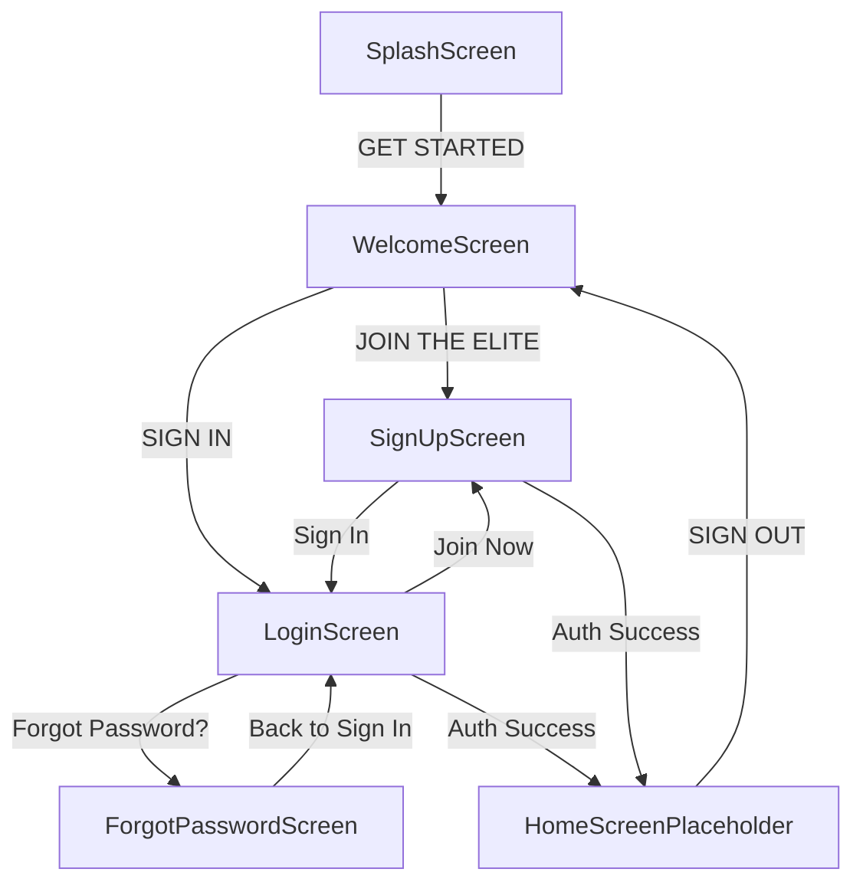

# Kinetra Mobile Engineering Progress

## Phase 27 — Mobile Foundation & Auth UI

**Status**: Complete  
**Platform**: React Native / Expo (TypeScript)  
**Visual Aesthetic**: Dark Luxury / Athletic AI Precision (Onyx `#050607`, Gold `#D9B83F` / `#F0C83E`, Crimson `#E63946`)

---

### 1. Architecture Overview

The mobile client is structured as a modular Expo application located in `/mobile`, isolated from the backend API server.

```
mobile/
├── App.tsx                       # Root application entry with SafeAreaProvider & AuthProvider
├── app.json                      # Expo application manifest
├── package.json                  # Dependencies: Expo, React Navigation, Supabase, LinearGradient
├── tsconfig.json                 # TypeScript compiler configuration
├── assets/
│   └── images/                   # Stitch visual reference assets & branding
└── src/
    ├── config/
    │   └── supabase.ts           # Supabase Client SDK (Anon/Public Client Key only)
    ├── context/
    │   └── AuthContext.tsx        # React context for user sessions, auth actions & errors
    ├── navigation/
    │   ├── types.ts              # RootStackParamList & ScreenProps typing
    │   └── RootNavigator.tsx      # Native stack navigation with dark luxury theme
    ├── theme/
    │   ├── colors.ts             # Exact color palette tokens
    │   ├── spacing.ts            # 8px spatial grid & borderRadius tokens
    │   ├── typography.ts         # Luxury serif headers & Inter UI styles
    │   └── index.ts              # Unified theme export
    ├── components/
    │   ├── KinetraButton.tsx     # Primary (Solid Gold), Secondary (Outline), DarkOutline, Text
    │   ├── KinetraInput.tsx      # High-contrast luxury inputs with icons & error highlights
    │   ├── PasswordInput.tsx     # Secure input with show/hide eye toggle & lock icon
    │   ├── ScreenBackground.tsx  # Fullscreen image background with dark gradient overlay
    │   ├── BrandLogo.tsx         # Kinetra serif wordmark & metallic emblem badge
    │   ├── ScreenHeader.tsx      # Header with back navigation and centered branding
    │   ├── AuthCard.tsx          # Glassmorphism container with optional gold indicator bar
    │   ├── Divider.tsx           # "OR CONTINUE WITH" divider
    │   ├── LoadingIndicator.tsx  # Gold spinner
    │   ├── InlineError.tsx       # Crimson error notification banner
    │   └── SocialAuthButton.tsx  # Apple & Google dark luxury auth buttons
    ├── screens/
    │   ├── SplashScreen.tsx      # Screen 1: Dark fitness visual, K mark, "GET STARTED →"
    │   ├── WelcomeScreen.tsx     # Screen 2: Athlete hero, "Redefine Your Limits", Action buttons
    │   ├── LoginScreen.tsx       # Screen 3: "Welcome Back", Email/Password, Social Auth
    │   ├── SignUpScreen.tsx      # Screen 4: "Join the Elite", Step 1 of 3, Name/Email/Pass
    │   ├── ForgotPasswordScreen.tsx # Screen 5: "Reset Password", Email input, reset feedback
    │   └── HomeScreenPlaceholder.tsx # Authenticated session landing with Sign Out
    └── utils/
        ├── authErrors.ts         # Human-friendly auth error mapping & sanitization
        └── validation.ts         # Field validators (email, password length, full name)
```

---

### 2. Navigation Flow & Routes



- **`Splash`**: Fullscreen dark runner visual, metallic K emblem, "ELITE INTELLIGENCE. REFINED PERFORMANCE.", "GET STARTED →" CTA.
- **`Welcome`**: Athlete hero visual, "Redefine Your Limits.", "JOIN THE ELITE" (Gold solid) and "SIGN IN" (Gold outline).
- **`Login`**: Gym barbell background, "Welcome Back" card, Email Address, Password with toggle, Forgot Password link, LOG IN CTA, Apple/Google social buttons, "Join Now" link.
- **`SignUp`**: Athlete background, "Join the Elite (Step 1 of 3)", Full Name, Email, Password, "CREATE ACCOUNT →", Terms notice, "Sign In" link.
- **`ForgotPassword`**: Barbell background, "Reset Password", instructions, Email input, "SEND RESET LINK", success/error states, "← Back to Sign In" link.
- **`HomePlaceholder`**: Authenticated landing screen showing user email, evolution status box, and Sign Out action.

---

### 3. Supabase Authentication Integration

- **SDK**: `@supabase/supabase-js` configured strictly with `EXPO_PUBLIC_SUPABASE_URL` and `EXPO_PUBLIC_SUPABASE_ANON_KEY`.
- **Security Invariant**: `SUPABASE_SERVICE_ROLE_KEY` is strictly prohibited and audited against all client files.
- **Session Persistence**: React Context listens to `onAuthStateChange` to automatically hydrate sessions.
- **Error Sanitization**: Raw database errors and internal stack traces are filtered into user-friendly messages (`Email or password is incorrect`, `An account with this email already exists`, etc.).

---

### 4. Design System Tokens

| Token Category | Value / Description |
|---|---|
| **Canvas Background** | `#050607` (Near-black / Onyx) |
| **Surface Layer** | `#111315` / `#161618` |
| **Card Surface** | `#17191B` |
| **Primary Text** | `#F4F1EA` / `#F8F9FA` (Titanium White) |
| **Secondary Text** | `#A7A5A0` |
| **Brand Gold** | `#D9B83F` |
| **Bright Gold CTA** | `#F0C83E` |
| **Crimson Error** | `#E63946` |
| **Spatial Grid** | 8px Grid (`xs: 4`, `sm: 8`, `md: 16`, `lg: 24`, `xl: 32`, `xxl: 48`) |
| **Border Radius** | `sm: 4` (technical buttons), `lg: 8` (cards), `full: 9999` |

---

### 5. Automated Verification Results

- **Mobile Unit & Security Tests**: 19 / 19 PASS
  - Form validation: 9 / 9 PASS
  - Auth error sanitization: 5 / 5 PASS
  - Theme token contract: 3 / 3 PASS
  - Security & secret leak check: 2 / 2 PASS
- **Mobile TypeScript Verification**: 0 errors (`npx tsc --noEmit`)
- **Backend Regression Suite**: 294 / 294 PASS (`npm test`)

---

### 6. Known Limitations & Next Steps

- **Social OAuth Providers**: Apple and Google buttons display mock alerts until mobile native bundle schemes and OAuth credentials are tied to live Apple Developer / Google Cloud consoles.
- **Onboarding Steps 2 & 3**: Step 1 (Account Creation) is completed; subsequent fitness profile onboarding will follow.
- **Next Phase**: **Phase 28 — Home Dashboard** (Hero workouts, daily focus cards, metrics summary, and bottom tab navigation).
