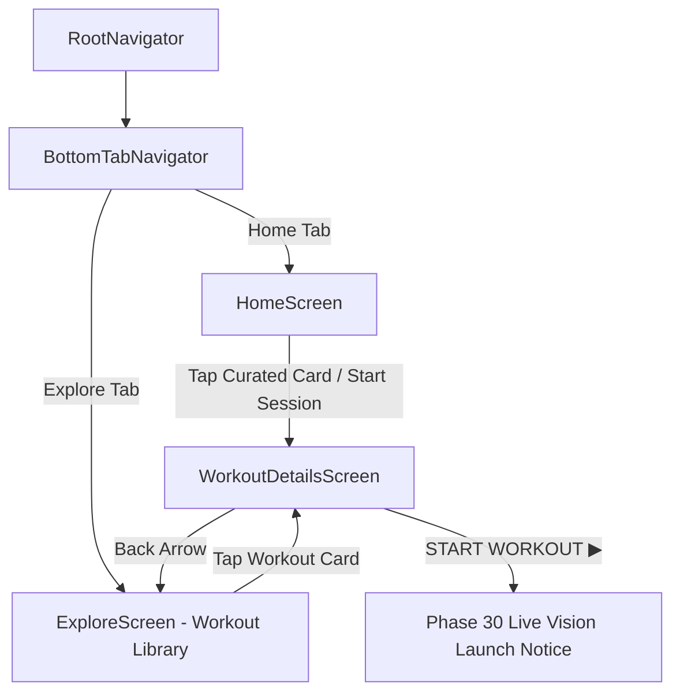

# Kinetra Mobile Engineering Progress

## Phase 27 — Mobile Foundation & Auth UI

**Status**: Complete  
**Platform**: React Native / Expo (TypeScript)  
**Visual Aesthetic**: Dark Luxury / Athletic AI Precision (Onyx `#050607`, Gold `#D9B83F` / `#F0C83E`, Crimson `#E63946`)

---

## Phase 28 — Home Dashboard & Mobile Navigation

**Status**: Complete  
**Platform**: React Native / Expo (TypeScript)  
**Visual Aesthetic**: Stitch UI Luxury Dark Athletic (Onyx `#050607`, Gold `#D9B83F`, Titanium `#F4F1EA`, Crimson `#E63946`)

---

## Phase 29 — Workout Library & Workout Details

**Status**: Complete  
**Platform**: React Native / Expo (TypeScript)  
**Visual Aesthetic**: Stitch UI Luxury Dark Athletic (Onyx `#050607`, Gold `#D9B83F`, Titanium `#F4F1EA`, Dark Surface `#111315`)

---

### 1. Architecture & Directory Structure

```
mobile/
├── App.tsx                       # Root application entry with SafeAreaProvider & AuthProvider
├── app.json                      # Expo application manifest
├── package.json                  # Dependencies & scripts (Expo, React Navigation, Supabase)
├── tsconfig.json                 # TypeScript compiler configuration
├── assets/
│   └── images/                   # Stitch visual reference assets & workout photography
└── src/
    ├── api/
    │   └── client.ts             # Typed API client (getWorkouts, getWorkoutById, getCurrentUserProfile)
    ├── config/
    │   └── supabase.ts           # Supabase Client SDK (Anon/Public Client Key only)
    ├── context/
    │   └── AuthContext.tsx        # React context for user sessions, auth actions & errors
    ├── navigation/
    │   ├── types.ts              # RootStackParamList (with WorkoutDetails) & MainTabParamList
    │   ├── RootNavigator.tsx      # Native stack navigator connecting auth, tabs & WorkoutDetails
    │   └── BottomTabNavigator.tsx # 5-tab luxury dark bottom navigation (Home, Explore/Workouts, Train, Stats, Profile)
    ├── theme/
    │   ├── colors.ts             # Exact color palette tokens
    │   ├── spacing.ts            # 8px spatial grid & borderRadius tokens
    │   ├── typography.ts         # Luxury serif headers & Inter UI styles
    │   └── index.ts              # Unified theme export
    ├── components/
    │   ├── Icon.tsx              # Vector icon primitives (home, explore, train, back, bookmark, play, warning, etc.)
    │   ├── MetricCard.tsx        # Form Score, Active Mins, and Calories metric card widgets
    │   ├── WorkoutCard.tsx       # Horizontal carousel workout card
    │   ├── WorkoutListCard.tsx   # Full-width vertical workout card for library catalog
    │   ├── KinetraButton.tsx     # Primary (Solid Gold), Secondary (Outline), DarkOutline, Text
    │   ├── KinetraInput.tsx      # High-contrast luxury inputs with icons & error highlights
    │   ├── PasswordInput.tsx     # Secure input with show/hide eye toggle & lock icon
    │   ├── ScreenBackground.tsx  # Fullscreen image background with dark gradient overlay
    │   ├── BrandLogo.tsx         # Kinetra serif wordmark & metallic emblem badge
    │   ├── ScreenHeader.tsx      # Header with back navigation and centered branding
    │   ├── LoadingIndicator.tsx  # Gold spinner
    │   └── InlineError.tsx       # Crimson error notification banner
    └── screens/
        ├── SplashScreen.tsx      # Splash visual
        ├── WelcomeScreen.tsx     # Welcome screen
        ├── LoginScreen.tsx       # Sign In screen
        ├── SignUpScreen.tsx      # Sign Up screen
        ├── ForgotPasswordScreen.tsx # Password recovery screen
        ├── HomeScreen.tsx        # Phase 28 Main Home Dashboard
        ├── ExploreScreen.tsx     # Phase 29 Full Workouts Library & Category Filter
        ├── WorkoutDetailsScreen.tsx # Phase 29 Full Workout Details & Circuit Protocol
        ├── TrainScreen.tsx       # Phase 30 Live Vision Training placeholder
        ├── StatsScreen.tsx       # Phase 32 Analytics & Progress placeholder
        └── ProfileScreen.tsx     # Phase 33 Profile & Sign Out placeholder
```

---

### 2. Navigation Architecture



---

### 3. Screen Implementations

1. **Workouts Library (`ExploreScreen.tsx`)**:
   - Header with user avatar profile shortcut, centered uppercase serif `WORKOUTS` wordmark, and bell notification button.
   - Horizontal category filter pills: `All`, `Strength`, `Mobility`, `Conditioning`, `Recovery` with active gold highlights.
   - Vertical workout feed using `WorkoutListCard` with photography, intensity/live badges, category label, serif title, description preview, duration pill (`⏱ 45 MIN`), and gold circular play button (`▶`).
   - State handling matching Stitch design:
     - Sleek loading indicators.
     - Empty state with filter reset action.
     - Exact Stitch **"Connection Interrupted"** error state card with warning circle and `⟳ RETRY` button.
     - Native pull-to-refresh (`RefreshControl`).

2. **Workout Details (`WorkoutDetailsScreen.tsx`)**:
   - Hero photography with dark gradient fade.
   - Top navigation overlay with rounded dark back (`←`) and bookmark (`🔖`) buttons.
   - Category label (`STRENGTH & POWER`), bold serif title (`Tactical Strength`), duration (`⏱ 45 Min`) and difficulty (`⚡ Advanced`) chips.
   - Description card with luxury typography.
   - **Circuit Protocol** exercise list displaying exercise thumbnail, exercise name, target muscle/movement (`Primary Posterior Chain`), sets badge (`4 Sets`), and reps count (`12 Reps`).
   - Sticky bottom full-width solid gold `START WORKOUT ▶` button.
   - **Safety Invariant**: Camera, MediaPipe, and pose tracking are not executed in Phase 29 (informative telemetry prompt provided).

---

### 4. API Integration & Security Invariants

- **Endpoints**:
  - `GET /api/v1/workouts`: List workouts with category filtering and pagination.
  - `GET /api/v1/workouts/:id`: Retrieve complete workout details with joined `workout_exercises` and `exercises` catalog entries.
- **JWT Authorization**: All requests include `Authorization: Bearer <Supabase JWT>`.
- **Zero Token Leakage**: Tokens and credentials are never logged to console or exposed in error details.
- **No Service Role Key**: Audited against mobile client codebase.

---

### 5. Automated Verification Results

- **Mobile Unit & Security Tests**: **48 / 48 PASS** (`mobile/package.json` -> `npm test`)
  - Workout Library & Details (Phase 29): 11 / 11 PASS
  - API Client & Token Security: 5 / 5 PASS
  - Auth Error Sanitization: 5 / 5 PASS
  - Home Dashboard & Personalization: 12 / 12 PASS
  - Mobile Security & Secret Leak Prevention: 2 / 2 PASS
  - Theme Tokens & 8px Grid: 3 / 3 PASS
  - Form Validators: 10 / 10 PASS
- **Mobile TypeScript Verification**: **PASS** (0 errors, `npm run typecheck`)
- **Expo Export & Bundler Verification**: **PASS** (792 iOS modules, 791 Android modules bundled, 0 errors)
- **Backend Regression Suite**: **294 / 294 PASS** (`npm test` in root)

---

### 6. Known Limitations & Next Steps

- **Live Vision Coaching Engine**: Tapping `START WORKOUT ▶` alerts that live camera streaming, MediaPipe landmarking, and rep telemetry will be implemented in Phase 30.
- **Next Phase**: **Phase 30 — Live Vision Coaching & Pose Tracking Interface**.
