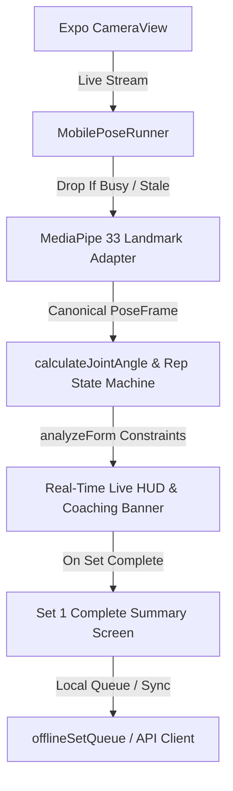

# Kinetra Mobile Engineering Progress

## Phase 27 — Mobile Foundation & Auth UI

**Status**: Complete  
**Platform**: React Native / Expo (TypeScript)  
**Visual Aesthetic**: Dark Luxury / Athletic AI Precision (Onyx `#050607`, Gold `#D9B83F` / `#F0C83E`, Crimson `#E63946`)

---

## Phase 28 — Home Dashboard & Mobile Navigation

**Status**: Complete  
**Platform**: React Native / Expo (TypeScript)  
**Visual Aesthetic**: Stitch UI Luxury Dark Athletic (Onyx `#050607`, Gold `#D9B83F`, Titanium `#F4F1EA`, Crimson `#E63946`)

---

## Phase 29 — Workout Library & Workout Details

**Status**: Complete  
**Platform**: React Native / Expo (TypeScript)  
**Visual Aesthetic**: Stitch UI Luxury Dark Athletic (Onyx `#050607`, Gold `#D9B83F`, Titanium `#F4F1EA`, Dark Surface `#111315`)

---

## Phase 30 — Live Vision Coaching & Pose Tracking Interface

**Status**: Complete  
**Platform**: React Native / Expo SDK 51 (TypeScript)  
**Visual Aesthetic**: Stitch UI Luxury Dark Athletic (Onyx `#050607`, Gold `#D9B83F`, Titanium `#F4F1EA`, Crimson `#E63946`)  
**Physical Device ML Validation**: **PENDING** (Awaiting real device camera sensor field testing)

---

### 1. Architecture & Directory Structure

```
mobile/
├── App.tsx                       # Root application entry with SafeAreaProvider & AuthProvider
├── app.json                      # Expo manifest with camera permissions & plugins
├── package.json                  # Dependencies (expo-camera, react-navigation, supabase)
├── tsconfig.json                 # TypeScript compiler configuration
├── assets/
│   └── images/                   # Visual assets & workout photography
└── src/
    ├── api/
    │   └── client.ts             # Typed API client with submitPoseAnalysis & logSessionExercise
    ├── config/
    │   └── supabase.ts           # Supabase Client SDK (Anon/Public Client Key only)
    ├── context/
    │   └── AuthContext.tsx        # React context for user sessions, auth actions & errors
    ├── engine/
    │   └── pose/
    │       ├── types.ts          # PoseLandmark, PoseFrame, ExerciseAnalysisConfig, FormRule, FormFlag
    │       ├── geometry.ts       # calculateJointAngle, ExerciseRepCounter state machine
    │       ├── formAnalyzer.ts   # Form deviation evaluator (lt, gt, between)
    │       ├── configs.ts        # Specifications for Squat, Lunge, Pushup, Bicep Curl
    │       ├── mediapipeAdapter.ts # 33-point MediaPipe/BlazePose canonical landmark adapter
    │       ├── PoseEngine.ts     # Core deterministic analysis engine
    │       └── mobilePoseRunner.ts # Mobile frame-drop policy & real-time telemetry loop
    ├── navigation/
    │   ├── types.ts              # RootStackParamList (with LiveWorkout) & MainTabParamList
    │   ├── RootNavigator.tsx      # Native stack navigator connecting auth, tabs, details & LiveWorkout
    │   └── BottomTabNavigator.tsx # 5-tab luxury dark bottom navigation
    ├── theme/
    │   ├── colors.ts             # Color palette tokens
    │   ├── spacing.ts            # 8px spatial grid & borderRadius tokens
    │   ├── typography.ts         # Luxury serif headers & Inter UI styles
    │   └── index.ts              # Unified theme export
    ├── utils/
    │   └── offlineQueue.ts       # Local completed set summary queue & sync manager
    ├── components/
    │   ├── PoseSkeletonOverlay.tsx # Stick-figure joint & limb rendering overlay
    │   ├── Icon.tsx              # Vector icon primitives
    │   ├── MetricCard.tsx        # Dashboard metric cards
    │   ├── WorkoutCard.tsx       # Carousel workout card
    │   ├── WorkoutListCard.tsx   # Library workout catalog card
    │   ├── KinetraButton.tsx     # Luxury buttons
    │   ├── KinetraInput.tsx      # High-contrast inputs
    │   ├── PasswordInput.tsx     # Secure input
    │   └── ScreenHeader.tsx      # Navigation header
    └── screens/
        ├── SplashScreen.tsx      # Splash visual
        ├── WelcomeScreen.tsx     # Welcome screen
        ├── LoginScreen.tsx       # Sign In screen
        ├── SignUpScreen.tsx      # Sign Up screen
        ├── ForgotPasswordScreen.tsx # Password recovery screen
        ├── HomeScreen.tsx        # Phase 28 Main Home Dashboard
        ├── ExploreScreen.tsx     # Phase 29 Workouts Library
        ├── WorkoutDetailsScreen.tsx # Phase 29 Workout Details & Circuit Protocol
        ├── LiveWorkoutScreen.tsx # Phase 30 Real Camera & Vision Coaching HUD
        ├── TrainScreen.tsx       # Training tab placeholder
        ├── StatsScreen.tsx       # Stats tab placeholder
        └── ProfileScreen.tsx     # Profile tab placeholder
```

---

### 2. Live Vision & Pose Engine Pipeline



---

### 3. Stitch Visual Fidelity States (Phase 30)

1. **Preparing Vision Coach**: Glowing gold reticle, initialization spinner.
2. **Camera Access Required**: High-contrast modal with lock button, app settings deep-link, standby indicator.
3. **Live Tracking HUD**: Full camera feed with `PoseSkeletonOverlay` stick-figure, floating HUD card (`REPS`, `STAGE`, `FORM SCORE`), and dynamic coaching banner (`💡 Keep your chest up`).
4. **Workout Paused**: Gold pause indicator, resume CTA, exit confirmation, elapsed metrics.
5. **Set Complete Summary**: Gold checkmark circle, Reps (12/12), Form Score (94/100) with sparkles, Duration, AI Insights bulleted feedback, and `Continue to Set 2 →` CTA.
6. **Vision Coach Error / Fallback**: Non-blocking warning banner with retry action while maintaining camera view.

---

### 4. Automated Verification Results

- **Mobile Unit & Security Tests**: **60 / 60 PASS** (`mobile/package.json` -> `npm test`)
  - Phase 30 Live Vision Coaching & Pose Tracking: 12 / 12 PASS
    - Category A: Deterministic PoseEngine & Geometry (6/6)
    - Category B: Real-time Frame Drop Policy & Monotonic Timestamps (4/4)
    - Category C: Offline Set Summary Queue (1/1)
    - Category D: Mobile Security & Zero Leakage (1/1)
  - Phase 29 Workout Library & Details: 11 / 11 PASS
  - API Client & Token Security: 5 / 5 PASS
  - Auth Error Sanitization: 5 / 5 PASS
  - Home Dashboard & Personalization: 12 / 12 PASS
  - Mobile Security & Secret Leak Prevention: 2 / 2 PASS
  - Theme Tokens & 8px Grid: 3 / 3 PASS
  - Form Validators: 10 / 10 PASS
- **Mobile TypeScript Verification**: **PASS** (0 errors, `npm run typecheck`)
- **Expo Export & Bundler Verification**: **PASS** (Web, iOS 800 modules, Android 806 modules bundled, 0 errors)
- **Backend Regression Suite**: **294 / 294 PASS** (`npm test` in root)
- **Security Check**: `SUPABASE_SERVICE_ROLE_KEY` is not present under `mobile/`.

---

### 5. Physical Device ML Validation Status

- **Automated Engine Verification**: **PASS**
- **Real Device ML Validation**: **PENDING** (Awaiting physical iOS/Android device field testing with live camera sensor).
